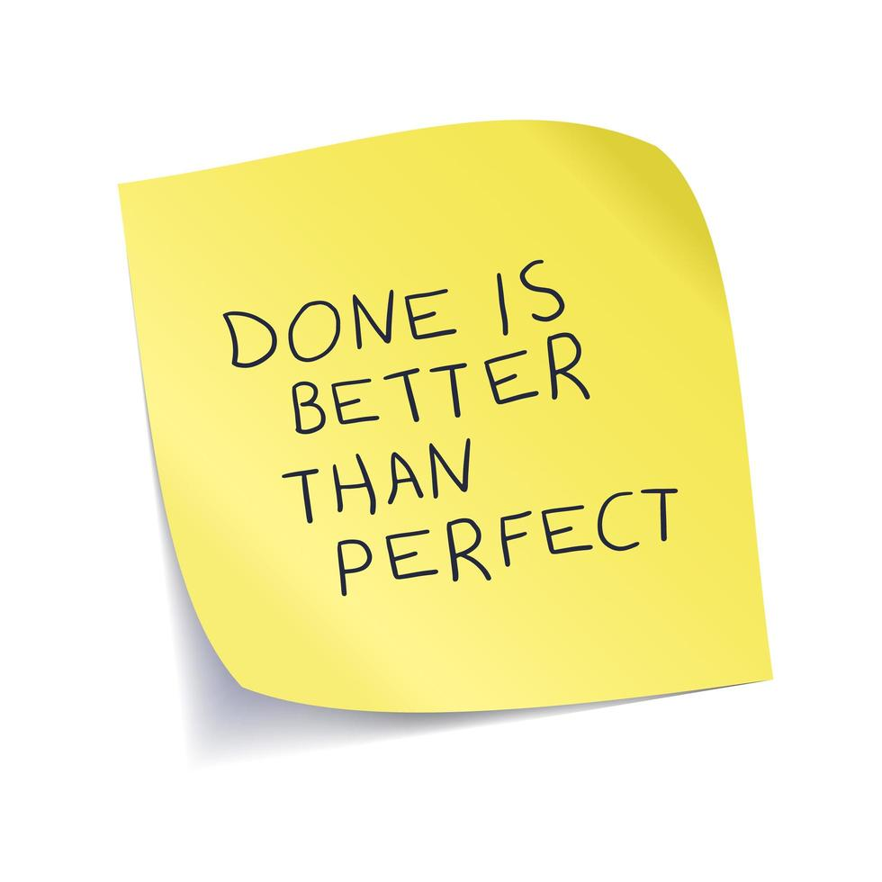

# Reconhecimento Óptico de Caracteres (OCR) com o Azure Vision Studio

Este projeto demonstra como usar as capacidades de OCR do Azure Vision Studio para extrair e analisar texto de imagens. O processo envolve o upload de imagens, a execução da análise OCR e a revisão dos dados de texto estruturados e caixas delimitadoras.

---

## **Visão Geral do Processo**

1. ### **Configuração dos Serviços de IA no Azure**:
      - Criado um recurso de IA do Azure com capacidades do Vision Studio.
      O **Cognitive Services** do Azure é uma coleção de APIs e serviços que permite incorporar inteligência artificial (IA) em aplicativos de maneira simples e escalável. No caso deste projeto, o serviço utilizado foi o **Azure Computer Vision**, com foco na funcionalidade de OCR (Optical Character Recognition).
      O objetivo é habilitar o reconhecimento de texto em imagens, utilizando algoritmos de IA para identificar, extrair e estruturar o texto presente em arquivos visuais como JPEG, PNG, entre outros. O OCR pode ser usado para automatizar processos como leitura de documentos digitalizados, extração de informações de placas, notas fiscais e muito mais.

   - Configurado o recurso no Vision Studio para habilitar o OCR.

#### **Passo a Passo da Configuração**

### **Criação do Recurso no Azure**
- **Login** no Portal do Azure: Acesse o [Portal do Azure](https://portal.azure.com) com sua conta.-
-  **Criação do Serviço**:
   - Navegue até a opção **Criar um recurso**.
   - Busque por **Cognitive Services** e selecione **Computer Vision**.
   - Escolha as seguintes configurações:
     - **Grupo de Recursos**: Crie um novo ou escolha um existente.
     - **Nome do Recurso**: Algo único e descritivo, como `OCR-VisionService`.
     - **Região**: Escolha uma região compatível com o OCR (exemplo: *westus2*).
     - **Plano de Tarifa**: Selecione a tarifa de acordo com o volume esperado de processamento.
- **Chave de API e Endpoint**:
   - Após a criação, vá para o recurso e copie a **Chave Primária** e o **Endpoint**.

### **Configuração no Vision Studio**
1. **Acessando o Vision Studio**:
   - Navegue para o [Vision Studio](https://azure.microsoft.com/en-us/products/ai-services/computer-vision/).
   - Faça login com as mesmas credenciais do Azure.
2. **Habilitar o OCR**:
   - No painel do Vision Studio, vá para a seção **Text Extraction**.
   - Insira o **Endpoint** e a **Chave de API** obtidos anteriormente.
   - Teste a conexão para verificar se o serviço está devidamente configurado.
3. **Teste Inicial**:
   - Faça upload de uma imagem de exemplo no Vision Studio para validar o funcionamento.
   - Observe os resultados, como o texto extraído e as informações de bounding box.

---

Essa configuração possibilita criar soluções avançadas de IA com base na análise de imagens e reconhecimento de texto, aplicáveis em diversos setores, permitindo automatização, integração e escalabilidade.


2. **Upload e Análise das Imagens**:

   - Estrutura do projeto:

```
/
├── inputs/
│   ├── sticker.jpg
│   ├── comprovante.jpeg
│   └── ...
├── outputs/
│   ├── sticker.json
│   ├── comrovante.json
│   └── ...
└── README.md
```

   - Executada a análise OCR para extrair dados de texto estruturados.

3. **Revisão dos Resultados**:
   - Texto identificado com precisão e caixas delimitadoras ao redor das áreas detectadas.
   - Dados organizados em uma hierarquia de **regiões**, **linhas** e **palavras**.

---

## **Insights e Observações**

- **Precisão**: O OCR reconheceu eficientemente texto impresso e manuscrito, organizando-o em um formato estruturado.
- **Utilidade**: Pode ser aplicado para digitalizar documentos, automatizar entrada de dados e melhorar a acessibilidade.
- **Visualização de Caixas Delimitadoras**: Áreas de texto destacadas foram marcadas com precisão, demonstrando as capacidades de detecção espacial do OCR.
- **Facilidade de Uso**: A interface do Vision Studio simplifica os testes sem necessidade de escrever código.

---


## **Imagens e Resultados de Exemplo**

### Antes do Processamento
#### Imagem do Stiker:



### Após o Processamento
#### Texto Detectado com Caixas Delimitadoras:
- Stiker:
  ```
  DONEIS
  BETTER
  THAN
  PERFECT
  ```
- Json:
  ```
        [
        {
          "lines": [
            {
              "text": "DONE IS",
              "boundingPolygon": [
                {
                  "x": 240,
                  "y": 342
                },
                {
                  "x": 618,
                  "y": 280
                },
                {
                  "x": 631,
                  "y": 355
                },
                {
                  "x": 252,
                  "y": 417
                }
              ],
              "words": [
                {
                  "text": "DONE",
                  "boundingPolygon": [
                    {
                      "x": 243,
                      "y": 344
                    },
                    {
                      "x": 484,
                      "y": 302
                    },
                    {
                      "x": 496,
                      "y": 379
                    },
                    {
                      "x": 254,
                      "y": 417
                    }
                  ],
                  "confidence": 0.995
                },
                {
                  "text": "IS",
                  "boundingPolygon": [
                    {
                      "x": 532,
                      "y": 294
                    },
                    {
                      "x": 619,
                      "y": 280
                    },
                    {
                      "x": 631,
                      "y": 356
                    },
                    {
                      "x": 544,
                      "y": 371
                    }
                  ],
                  "confidence": 0.99
                }
              ]
            },
            {
              "text": "BETTER",
              "boundingPolygon": [
                {
                  "x": 314,
                  "y": 419
                },
                {
                  "x": 648,
                  "y": 362
                },
                {
                  "x": 661,
                  "y": 439
                },
                {
                  "x": 324,
                  "y": 492
                }
              ],
              "words": [
                {
                  "text": "BETTER",
                  "boundingPolygon": [
                    {
                      "x": 317,
                      "y": 423
                    },
                    {
                      "x": 642,
                      "y": 364
                    },
                    {
                      "x": 656,
                      "y": 441
                    },
                    {
                      "x": 326,
                      "y": 492
                    }
                  ],
                  "confidence": 0.987
                }
              ]
            },
            {
              "text": "THAN",
              "boundingPolygon": [
                {
                  "x": 308,
                  "y": 519
                },
                {
                  "x": 524,
                  "y": 478
                },
                {
                  "x": 537,
                  "y": 545
                },
                {
                  "x": 319,
                  "y": 587
                }
              ],
              "words": [
                {
                  "text": "THAN",
                  "boundingPolygon": [
                    {
                      "x": 313,
                      "y": 518
                    },
                    {
                      "x": 500,
                      "y": 483
                    },
                    {
                      "x": 512,
                      "y": 552
                    },
                    {
                      "x": 325,
                      "y": 587
                    }
                  ],
                  "confidence": 0.989
                }
              ]
            },
            {
              "text": "PERFECT",
              "boundingPolygon": [
                {
                  "x": 361,
                  "y": 593
                },
                {
                  "x": 758,
                  "y": 531
                },
                {
                  "x": 770,
                  "y": 608
                },
                {
                  "x": 369,
                  "y": 670
                }
              ],
              "words": [
                {
                  "text": "PERFECT",
                  "boundingPolygon": [
                    {
                      "x": 361,
                      "y": 593
                    },
                    {
                      "x": 751,
                      "y": 532
                    },
                    {
                      "x": 767,
                      "y": 609
                    },
                    {
                      "x": 369,
                      "y": 670
                    }
                  ],
                  "confidence": 0.994
                }
              ]
            }
          ]
        }
      ]

```


## **Possibilidades Futuras**

- Integração em aplicativos web ou móveis para tarefas de OCR em tempo real.
- Automação aprimorada para processamento de formulários e análise de documentos.
- Combinação do OCR com APIs de tradução para reconhecimento de texto multilíngue.
